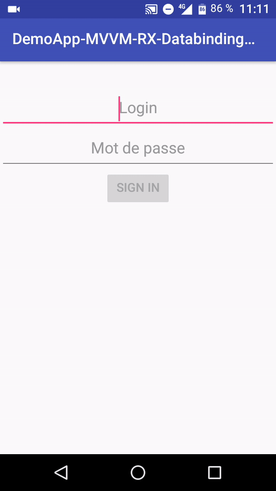

# Android Demo App
* Combine RxJava and android databinding
* Two ways databinding
* Anko library [Github link](https://github.com/Kotlin/anko)
* Kotlin Extensions
* Android Lifecycle
* Retrofit
* JUnit Test
* MVMM Architecture

